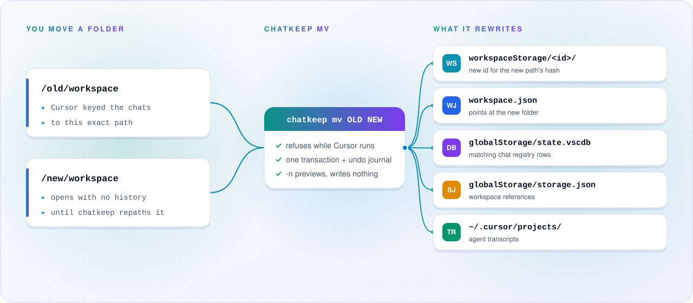

<div align="center">

<picture>
  <source media="(prefers-color-scheme: dark)" srcset="assets/banner-dark.svg">
  
</picture>

<br>

<a href="https://github.com/SherinBloemendaal/chatkeep/actions/workflows/ci.yml"></a>
<a href="https://github.com/SherinBloemendaal/chatkeep/releases/latest"></a>
<a href="LICENSE"></a>


**Chatkeep** (`chatkeep`) keeps Cursor and Claude Code chat history attached to a project when the folder moves.<br>
Repo: [github.com/SherinBloemendaal/chatkeep](https://github.com/SherinBloemendaal/chatkeep)

[Install](#-install) · [How it works](#-how-it-works) · [Tool still open?](#-the-tool-is-still-open) · [Commands](#-commands) · [Claude Code](#-claude-code) · [Index](#-index) · [Profiles](#-profiles)

</div>

<br>

## ✨ Highlights

- **Chats follow the folder.** `mv` rewrites the local references of Cursor and Claude Code, so history reattaches at the new path.
- **One command, every tool.** `ls`, `mv`, `cp`, `rm`, `split`, `combine`, `export`, `import`, `stats`, and the queue work on Cursor and on Claude Code. `--tool` limits a run to one of them.
- **Reshape history.** `split` and `combine` hand chats to other projects, as copies or for good.
- **Safe writes.** Refuses while the tool still uses the chats, writes with an undo journal, and `-n` previews first.
- **Accounts stay in step.** `chatkeep claude sync auto on` keeps the chat lists of your Claude desktop accounts the same in the background: new chats and new titles show up under every account of a sync profile.
- **Queue for later.** Blocked commands go into a queue that runs once the tool is closed.
- **Every installation.** Sees each Cursor profile, including windows started with `--user-data-dir`, and every account of the Claude desktop app.
- **Local only.** It never contacts the servers of Cursor or Anthropic. See [DISCLAIMER.md](DISCLAIMER.md).

## 📦 Install

### macOS / Linux

```bash
curl -fsSL https://sherin.dev/chatkeep/install.sh | bash
```

Pin a release with `bash -s`:

```bash
curl -fsSL https://sherin.dev/chatkeep/install.sh | bash -s v1.1.0
```

The script installs `chatkeep` to `~/.chatkeep/bin` (override with `CHATKEEP_INSTALL`). It adds that directory to your zsh, bash, or fish config when the line is missing, and links `chatkeep` into the first writable directory already on your `PATH` (`~/.local/bin`, `~/bin`, `/opt/homebrew/bin`, or `/usr/local/bin`), so it works at once in every open terminal. Without such a directory it prints the one `source` command that loads it. Run it again to upgrade in place. `chatkeep uninstall` removes the binary, that link, and that PATH line. `--purge` also deletes `~/.chatkeep`.

### Windows

```powershell
powershell -c "irm https://sherin.dev/chatkeep/install.ps1|iex"
```

`$env:CHATKEEP_VERSION` pins a tag (`v1.1.0`). `$env:CHATKEEP_INSTALL` overrides the install directory (default `%USERPROFILE%\.chatkeep\bin`). The script adds that directory to the user PATH when it is missing, and prints a one-line `$env:Path` command for terminals that were already open. `chatkeep uninstall` removes that user PATH entry. `--purge` also deletes `%USERPROFILE%\.chatkeep`.

<details>
<summary><b>Published archives</b></summary>

<br>

Checked against `SHA256SUMS` on the GitHub release:

| Platform             | Asset                                       |
| -------------------- | ------------------------------------------- |
| macOS Apple Silicon  | `chatkeep-aarch64-apple-darwin.tar.gz`      |
| macOS Intel          | `chatkeep-x86_64-apple-darwin.tar.gz`       |
| Linux x86_64 (glibc) | `chatkeep-x86_64-unknown-linux-gnu.tar.gz`  |
| Linux arm64 (glibc)  | `chatkeep-aarch64-unknown-linux-gnu.tar.gz` |
| Windows x64          | `chatkeep-x86_64-pc-windows-msvc.zip`       |

</details>

## 🧭 How it works

<picture>
  <source media="(prefers-color-scheme: dark)" srcset="assets/how-it-works-dark.svg">
  
</picture>

Cursor stores chats against a workspace path. Rename or move that folder and the history stays behind. `chatkeep` rewrites the local references so the chats follow.

> [!NOTE]
> It is not affiliated with Anysphere. It only reads files already on your machine. See [DISCLAIMER.md](DISCLAIMER.md).

## ⏳ The tool is still open?

> [!WARNING]
> Close the tool before any command that writes. For Cursor, `chatkeep` reads the native process table, aborts if any Cursor instance of any profile is running (including windows started with `--user-data-dir`), and checks again between steps. For Claude Code it only needs the projects it changes to be free: no session may run in them, and the desktop app must be closed when the command rewrites chats it lists. If the process table cannot be read, writes are refused.

Exit code **75** (`EX_TEMPFAIL`) means a tool is still in the way; queue the command and retry after you close it. `ls`, `stats`, and `history` never wait on this check. `-n` previews without writing and is allowed while the tool is open. `-y` skips the single warning prompt.

Instead of a dead end, `chatkeep` prints a copy-paste hint and exits **75**. These stderr lines are stable:

- Cursor is open: `chatkeep: cursor-running; queue with: chatkeep queue add -- <args>`
- A Claude Code session or the desktop app is in the way: `chatkeep: claude-busy; queue with: chatkeep queue add -- <args>`
- `queue execute` blocked: `chatkeep: cursor-running; queued: <N> pending; run later: chatkeep queue execute` (or `claude-busy` in place of `cursor-running`)

```bash
chatkeep mv --replace /Machines/older/ /Machines/upgraded/ --profile workshop
# ✖ Cursor is running: workshop (pid …).
#   Queue it with: chatkeep queue add -- mv --replace /Machines/older/ /Machines/upgraded/ --profile workshop
# chatkeep: cursor-running; queue with: chatkeep queue add -- mv --replace /Machines/older/ /Machines/upgraded/ --profile workshop

chatkeep queue add -- mv --replace /Machines/older/ /Machines/upgraded/ --profile workshop
# quit Cursor
chatkeep queue execute
# if Cursor is still open:
# ✖ Cursor is running: default (pid …).
#   Close Cursor, then run: chatkeep queue execute
# chatkeep: cursor-running; queued: 1 pending; run later: chatkeep queue execute
```

A command for both tools runs Claude Code's half first. When Cursor is open, only Cursor's half waits: the hint queues it with `--tool cursor`.

<details>
<summary><b>Queue details</b></summary>

<br>

`queue list` (alias `ls`) shows pending, failed, skipped, and interrupted entries. Successful runs are removed from the queue (and already logged in `chatkeep history`). `queue rm` removes any status by id. `queue clear` empties the whole file. `queue retry [id...]` resets failed/skipped entries to pending (`queue retry` alone resets all of them). `queue execute` requires the tools its pending entries change to be closed (except `-n`, which replans only, asks nothing, and writes nothing): Cursor for entries that touch Cursor, and a free project for entries that touch Claude Code. It re-plans against live data under each entry's stored cwd (up to 8 plans at a time, each shown with a spinner and its time), confirms once, then runs pending entries one by one in order, since later entries build on earlier ones (stop on first failure unless `--continue-on-error`). Each finished entry leaves a `✔`/`✖` line with how long it took. A crash mid-entry leaves that row failed as interrupted so the next execute does not rerun it. `queue execute` exits **1** when any entry in that run failed or was skipped. At execute time relative paths (including a relative `--replace` result) resolve against that stored cwd, exactly as if you ran the command from there, and workspace or chat ids stay as typed (hints keep the original argv; `queue list` shortens long commands to fit the terminal, and `queue list --full` shows them exactly as stored). The queue file is `~/.chatkeep/queue.jsonl` (override with `CHATKEEP_HOME`).

</details>

## 🧰 Commands

Without `--tool`, a command that names a project runs for every tool that has it. A command with no arguments opens a picker; with both tools installed it first asks which one. `chatkeep` on its own prints the help.

| Command                                  | What it does                                                     |
| ---------------------------------------- | ---------------------------------------------------------------- |
| `chatkeep ls [ID]`                       | List projects, or the chats of one. Alias: `list`.               |
| `chatkeep mv [FROM] [TO]`                | Repath chats after a folder moved. Alias: `move`.                |
| `chatkeep cp [FROM] [TO]`                | Copy a project's chats to another folder. Alias: `copy`.         |
| `chatkeep split [SOURCE] [TARGETS...]`   | Copy chats from one project into separate projects.              |
| `chatkeep combine [TARGET] [SOURCES...]` | Pull chats from several projects or single chats into one.       |
| `chatkeep rm [TARGET]`                   | Remove a project's chats, or one chat. One confirmation.         |
| `chatkeep export [TARGET] [FILE]`        | Write a `.chatkeep` archive. One archive holds one tool.         |
| `chatkeep import [FILE] [TO]`            | Restore an archive, optionally into another folder.              |
| `chatkeep stats`                         | Projects, chats, disk, tokens, and models.                       |
| `chatkeep history`                       | The local command log of the last 30 days.                       |
| `chatkeep queue ACTION`                  | Queue write commands while a tool is open. Exit 75 when blocked. |

<details>
<summary><b>Cursor only:</b> <code>chatkeep cursor …</code></summary>

<br>

| Command                                    | What it does                                                                   |
| ------------------------------------------ | ------------------------------------------------------------------------------ |
| `chatkeep cursor save [ID] [TO]`           | Attach an unsaved `Workspaces/<ts>` session to a folder or `.code-workspace`.  |
| `chatkeep cursor rx [TARGET]`              | Rebuild registry refs, rewrite leftover paths, clear caches. Alias: `reindex`. |
| `chatkeep cursor cache clear\|scan\|stats` | Clear, rescan, or inspect the [index](#-index).                                |

</details>

<details>
<summary><b>Claude Code only:</b> <code>chatkeep claude …</code></summary>

<br>

| Command                                         | What it does                                                       |
| ----------------------------------------------- | ------------------------------------------------------------------ |
| `chatkeep claude accounts ls`                   | The accounts of the desktop app and how many chats each one lists. |
| `chatkeep claude accounts cp [FROM] [TO]`       | List the chats of one account under another, once.                 |
| `chatkeep claude sync [PROFILE]`                | Bring the accounts of a sync profile in step, in both directions.  |
| `chatkeep claude sync set NAME ACCOUNT ACCOUNT` | Create or replace a sync profile.                                  |
| `chatkeep claude sync profiles`                 | Show the sync profiles and whether the background sync runs.       |
| `chatkeep claude sync rm NAME`                  | Remove a sync profile.                                             |
| `chatkeep claude sync watch [PROFILE]`          | Keep syncing whenever a chat list changes, until stopped.          |
| `chatkeep claude sync auto on\|off\|status`     | Run that watcher in the background from login on.                  |
| `chatkeep claude sync log`                      | Show what the syncs changed: which chat, how, for which account.   |
| `chatkeep claude cache clear\|stats`            | Clear or inspect the index of the transcripts.                     |

See [Claude Code](#-claude-code) for what each of these does.

</details>

<details>
<summary><b>Chatkeep itself</b></summary>

<br>

| Command                   | What it does                                                |
| ------------------------- | ----------------------------------------------------------- |
| `chatkeep help [COMMAND]` | The help screen, or every option of one command.            |
| `chatkeep update`         | Download, verify, and install the latest release.           |
| `chatkeep uninstall`      | Remove the binary, its PATH entry, and the background sync. |
| `chatkeep github`         | Open the repository in the browser.                         |

</details>

<details>
<summary><b>Command notes</b></summary>

<br>

`chatkeep update` checks `SHA256SUMS`, then replaces the binary in `$CHATKEEP_INSTALL` or `~/.chatkeep/bin`.

`chatkeep github` opens https://github.com/SherinBloemendaal/chatkeep.

`mv` and `cp` change the tools' own records only, never your project folder. `--project` also moves or copies the real folder, and is refused when the destination parent is missing.

`split` copies by default. `--move` removes the chats from the source.

`combine` copies by default (`--copy`). `--move` removes the chats from the sources. The target can be an existing project, or a real folder (for Cursor also a `.code-workspace` path) that `chatkeep` creates a project for. Sources are whole projects or individual chat ids. With both tools installed, each tool gets the sources it knows.

`cursor rx` rebuilds the chat registry from the workspace's `workspace.json`: it fixes stale `workspaceIdentifier` entries, adopts chats that still point at this path from a workspace id that no longer exists, rewrites their old paths, and clears caches.

`ls` columns for Cursor: dest (present, missing, or none), workspace, kind (folder, code-workspace, unsaved, empty-window, remote), profile, chats, subagents, size, and the first 8 characters of the hash. Missing destinations come first, then the largest workspaces. `--unsaved` limits the table to unsaved sessions. The profile column names the Cursor installation (see [Profiles](#-profiles)), plus `/NAME` for a VS Code profile other than the default one.

For Cursor, `stats` only reports what Cursor records: usage cost and requests, the context size at the last turn, and message tokens, each with the number of conversations that carry it. Message tokens are partial: only counts stored inline in the chat are included, and newer chats store tokens per message. `ls` and `stats` open the databases read-only and never create files next to them.

A missing destination is a warning. That item is skipped.

</details>

### Shared flags

| Flag                | Effect                                                 |
| ------------------- | ------------------------------------------------------ |
| `-n`                | Dry-run. Show the plan and write nothing.              |
| `-y`                | Skip the single warning prompt.                        |
| `--profile NAME`    | Limit the run to one Cursor installation. Cursor only. |
| `--tool TOOL`       | Only `cursor` or `claude`. Default: every tool found.  |
| `--replace FROM TO` | Batch-rewrite a path prefix.                           |
| `--regex`           | Treat `--replace` FROM as a regular expression.        |
| `--unsaved`         | Only unsaved `Workspaces/<ts>` sessions. Cursor only.  |
| `--color WHEN`      | Color output: `auto` (default), `always`, or `never`.  |

`auto` colors a terminal and honors `NO_COLOR`, `CLICOLOR_FORCE`, `FORCE_COLOR`, `CLICOLOR=0`, and `TERM=dumb`.

### Command flags

| Flag                  | Commands            | Effect                                                |
| --------------------- | ------------------- | ----------------------------------------------------- |
| `--project`           | `mv`, `cp`          | Also move or copy the real project folder.            |
| `--move`              | `split`, `combine`  | Move the chats instead of copying them.               |
| `--copy`              | `combine`           | Keep the chats in the sources (the default).          |
| `--overwrite`         | `import`            | Replace chats that already exist instead of skipping. |
| `--continue-on-error` | `queue execute`     | Keep going after an entry fails.                      |
| `--full`              | `queue list`        | Show stored commands in full instead of shortened.    |
| `--fresh`             | `ls`, `stats`       | Read every file again, then refresh the index.        |
| `--full`              | `cursor cache scan` | Rebuild the index from scratch.                       |

### Examples

```bash
chatkeep mv --replace /Machines/older/ /Machines/upgraded/ -y
chatkeep cursor save 1700000000000 ~/projects/foo
chatkeep split 0123456789abcdef0123456789abcdef ~/projects/api ~/projects/frontend
chatkeep combine ~/projects/api aaaaaaaabbbbbbbbccccccccdddddddd 9f8e7d6c5b4a39281706f5e4d3c2b1a0 --move
chatkeep cp ~/projects/api ~/projects/api-v2 --tool claude
chatkeep claude accounts cp 1a2b3c4d
```

## 📇 Index

For Cursor, `ls`, `ls <id>`, `stats`, the pickers, and the split auto-suggest read from a persistent index in `~/.chatkeep/index.db`. The first `ls` or `stats` for an installation builds it in the foreground. Later runs render from the index at once, print a dim `as of HH:MM` note on stderr, and start `chatkeep __refresh-index` detached in the background, at most once a minute.

> [!TIP]
> Write commands never trust the index: they read live data before and while they write. After a successful write the installation is marked dirty, so the next read refreshes it first.

| Command                                        | What it does                                                                                    |
| ---------------------------------------------- | ----------------------------------------------------------------------------------------------- |
| `chatkeep cursor cache stats`                  | Index size and schema, last scan and stale sources per installation, and the background status. |
| `chatkeep cursor cache scan [--profile NAME]`  | Refresh now with progress bars. `--full` rebuilds. `-n` only lists what is stale.               |
| `chatkeep cursor cache clear [--profile NAME]` | Delete the index, or only one installation's rows. One confirmation. Refused during a refresh.  |

`--fresh` bypasses the index for one `ls` or `stats` and refreshes it afterwards. `CHATKEEP_NO_INDEX=1` turns the index off completely, for both tools.

Claude Code has its own index in `~/.chatkeep/claude-index.db`: one row per transcript with the folder it runs in, its title, its tokens and models, keyed by the file's size and modification time. Every `ls` or `stats` reads only the transcripts that changed, drops the rows of transcripts that are gone, and so is always current; there is no background refresh and no `as of` note. `chatkeep claude cache stats` shows it, `chatkeep claude cache clear` deletes it. `CHATKEEP_HOME` moves chatkeep's state directory (history, backups, index) away from `~/.chatkeep`.

Chatkeep used to be called crepath. The first run with the default home moves the old `~/.crepath` state (history, queue, backups, index) into `~/.chatkeep`, and leaves `~/.crepath/bin` behind so `crepath uninstall` can still remove the old binary and its PATH line.

<details>
<summary><b>How the background refresh works</b></summary>

<br>

That refresh opens Cursor's databases read-only, re-reads only the files whose size or modification time changed (`state.vscdb` and its `-wal`, `storage.json`, and each workspace's `workspace.json` and `state.vscdb`), and reads chat data only for chats whose header changed. `~/.chatkeep/index.lock` lets one refresh run at a time, and `~/.chatkeep/refresh.log` keeps its output, trimmed to the newest 64 KB once it passes 256 KB.

</details>

## 🔀 Split assignment

`split` asks which chats go where. Three modes, in this order:

1. **Auto-suggest (default).** For each chat, touched file paths (for Claude Code: the files its tools read or wrote) are mapped to the longest matching target root. A table shows the title, date, and suggested targets. Space toggles targets. Chats with no evidence stay **unassigned** until you pick a target.
2. **All to all.** Every chat is copied to every target.
3. **Manual.** Pick chats per target, with no suggestions.

## 🧳 Export archive

For Cursor, `export` writes a `.chatkeep` gzip archive: the `workspaceStorage` directory, the projects directory, `composerHeaders` rows, composer-keyed `cursorDiskKV` rows, the `agentKv` blobs those chats reference, a `storage.json` excerpt, and a manifest with version and checksums. Rows keep their SQLite type, so `NULL` and binary values survive. `export` refuses to overwrite an existing file.

`import` verifies every checksum, rejects unsafe paths and ids, and writes in one transaction. Chats that already exist are skipped unless you pass `--overwrite`. With `TO`, the workspace id is recomputed for that path and the chats' paths are rewritten to it.

For Claude Code, the archive holds the project folder from `~/.claude/projects` (transcripts, subagents, tool output, memory), the rewind checkpoints in `file-history`, the project's entry in `~/.claude.json`, its lines of the prompt history, and the desktop app's entries. `import` restores each of those, keeps settings and memory files the folder already has, and rewrites the paths when `TO` names another folder.

## 🤖 Claude Code

Every shared command works on Claude Code. Without `--tool`, a command runs for every tool that has the project: `chatkeep mv ~/old ~/new` repaths the Cursor workspace and the Claude Code project in one go.

Claude Code keeps one folder per path in `~/.claude/projects/`, named after the path with every character outside `A-Z`, `a-z`, and `0-9` turned into `-` (paths longer than 200 characters are cut and get a hash, exactly as Claude Code does). `CLAUDE_CONFIG_DIR` is honored for both `~/.claude` and `.claude.json`.

| Command   | What it does for Claude Code                                                                                                                                                                                                                      |
| --------- | ------------------------------------------------------------------------------------------------------------------------------------------------------------------------------------------------------------------------------------------------- |
| `mv`      | Moves the project folder, or merges it into the destination's, and rewrites the old path in transcripts, subagent transcripts, tool output, and memory. Moves the entry in `~/.claude.json`, and repoints the prompt history and the desktop app. |
| `cp`      | Gives the new folder its own copy of every chat, under a new session id, with the paths rewritten. Copies memory, settings, rewind checkpoints, and the desktop app's entries.                                                                    |
| `split`   | Hands chats to the projects of other folders, as copies or with `--move`. The paths a chat mentions stay as they are: the files it worked on did not move.                                                                                        |
| `combine` | The same, from several projects or single sessions into one.                                                                                                                                                                                      |
| `rm`      | `rm PATH` removes a project, `rm SESSION_ID` one session, with everything keyed to those sessions: `file-history`, `session-env`, `todos`, the prompts in `history.jsonl`, and the desktop app's entries.                                         |
| `export`  | Packs the project into a `.chatkeep` archive (see [Export archive](#-export-archive)).                                                                                                                                                            |
| `import`  | Restores it, optionally into another folder.                                                                                                                                                                                                      |
| `stats`   | Projects, sessions, subagents, tokens (each answer counted once), models, and sessions per month.                                                                                                                                                 |

A merge stops before it starts when both projects hold a different file with the same name. Identical files are kept once, and the two `memory/MEMORY.md` indexes are merged line by line.

A copied chat is a chat of its own. It does not keep the link to the remote session of its original, so the two never write to the same one.

### Desktop app accounts

The Claude desktop app keeps its chat list per account. The chats themselves live in `~/.claude/projects` and belong to no account, so after you sign in with another account the old chats are still on disk but no longer listed.

```bash
chatkeep claude accounts ls          # every account, and how many of its chats are still on disk
chatkeep claude accounts cp OLD      # list the chats of OLD under the account signed in now
```

`OLD` is an account id or the start of one. `accounts cp` copies only the list entries, never a transcript: both accounts then open the same chat. It skips chats without a transcript on this machine and chats the account already lists, never overwrites an entry, and leaves out what belongs to the old account (its remote session and its connectors). Restart the desktop app to see them.

### Syncing accounts

`accounts cp` is a one-off. A sync profile keeps accounts the same from then on:

```bash
chatkeep claude sync set work ACCOUNT_A ACCOUNT_B   # these accounts share their chats
chatkeep claude sync                                # sync every profile now
chatkeep claude sync auto on                        # and keep doing it in the background
```

A profile is a named group of accounts, so work accounts sync with work accounts and private ones with private ones. An account belongs to one profile at most.

Inside a profile the sync goes both ways:

- **Add.** A chat one account lists is listed by all of them.
- **Update.** When two accounts hold a different entry for the same chat (a new title, pinned, archived), the entry whose file changed last wins. The copy keeps that file time, and each account keeps what belongs to it (its remote session and its connectors).
- **Remove, only after you say yes.** A chat that an account listed at the last sync and no longer lists was deleted there. It is never added back. It leaves the other accounts only when you run `chatkeep claude sync` in a terminal and confirm; `-y`, the watcher, and the background runner never remove anything.

While the desktop app is open, changes to entries of the account it is signed in with wait, because the app would write its own copy back; new chats are still added, and show after a restart of the app. Everything for the other accounts happens at once.

`chatkeep claude sync watch` looks at the chat lists every few seconds (`--interval`) and syncs when one changed. `chatkeep claude sync auto on` runs that watcher from login on (a launch agent on macOS; on other systems start `sync watch` yourself), `auto off` stops and removes it, and `chatkeep uninstall` removes it too. The profiles are in `~/.chatkeep/sync.json`.

`chatkeep claude sync log` shows what every sync changed, newest last: when, whether a chat was added, updated, or removed, its title, which fields differed, for which account, and whether you or the watcher did it. The app saves an open chat every few seconds, so the same update repeated in a row is one line with a count. `--last ROWS` sets how many rows to show (30 by default). The log is `~/.chatkeep/sync-log.jsonl` and keeps its newest part once it passes 512 KB.

> [!NOTE]
> This only covers chats that ran on this machine. Chats that ran in Anthropic's cloud (claude.ai/code) are stored with the account they were started under, and no local tool can move those.

> [!IMPORTANT]
> chatkeep refuses to touch a Claude Code project while a session runs in it (it reads `~/.claude/sessions/` and checks each process), and refuses to change entries the desktop app lists while the app is open, because the app would write its own copy back. Adding new entries is safe while it runs. Every change goes through the same undo journal in `~/.chatkeep/backups`, so a failure halfway puts every file back.

## 💾 Where Cursor stores it

Workspace ids follow VS Code's formula. A folder hashes its path plus its birth time in milliseconds (rounded on macOS, floored on Windows) or, on Linux, its inode. A `.code-workspace` file or an unsaved `Workspaces/<ts>/workspace.json` hashes its config path, lowercased except on Linux. Paths are normalized first (absolute, no `.`/`..`, no trailing separator), and Windows paths use Cursor's `file:///c%3A/...` URI form.

| Platform | Workspace storage                                             |
| -------- | ------------------------------------------------------------- |
| macOS    | `~/Library/Application Support/Cursor/User/workspaceStorage/` |
| Linux    | `~/.config/Cursor/User/workspaceStorage/`                     |
| Windows  | `%APPDATA%\Cursor\User\workspaceStorage\`                     |

`chatkeep` also updates `workspace.json`, `globalStorage/storage.json`, the matching rows in `globalStorage/state.vscdb`, and `~/.cursor/projects/`.

> [!IMPORTANT]
> Every write command runs as one database transaction with an undo journal in `~/.chatkeep/backups`: the original image of each row it touches, plus copies of `storage.json` and the workspace files it changes. If a step fails, verification fails, or Cursor starts, everything is rolled back, including folder moves and transcripts. The journal is deleted after a verified run and kept only when a rollback could not finish. Free space is checked up front for the database log, the journal, and any copies.

## 👥 Profiles

Every Cursor installation on the machine is a profile: the default user data directory above, any sibling `Cursor*` directory next to it (`Cursor Nightly` becomes `nightly`), and every `~/.cursor-NAME` directory that Cursor was started on with `--user-data-dir ~/.cursor-NAME` (it becomes `NAME`). Each has its own `workspaceStorage`, `globalStorage/state.vscdb`, and `storage.json`. All of them write agent transcripts into the one shared `~/.cursor/projects/`, keyed by folder path.

`ls` and `stats` cover every profile. `stats` counts them and adds a table per profile with its workspaces, chats, subagents, and global database size. `--profile NAME` limits any command to one installation. `--profile NAME/PROFILE` narrows it to one VS Code profile (`userDataProfiles` in `storage.json`) inside it, and a bare VS Code profile name works when only one installation has it.

Write commands never mix installations. Without `--profile` they use the installation that holds the workspace or chat you name, ask in a terminal when several do, and otherwise stop and ask for `--profile`. Sources from different installations are refused, and so is a target that only exists in another installation. When a folder is open in more than one installation, `mv` moves only this installation's transcripts in `~/.cursor/projects/` and copies the rest of that directory, `export` leaves the other installations' transcripts out, and `mv --project` warns that the other installations will point at a missing folder.

## 🔨 Build from source

Requires Rust 1.88+.

```bash
git clone https://github.com/SherinBloemendaal/chatkeep
cd chatkeep
cargo install --path .
```

The README images in `assets/` are generated by `scripts/readme-images.py`.

## 📄 License

[MIT](LICENSE)
